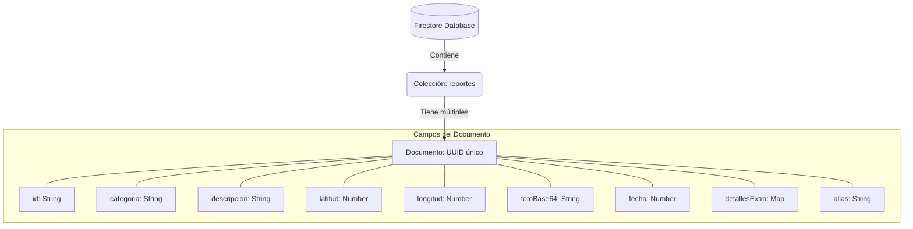

# 📢 Plataforma de Participación Ciudadana (Android)

Una aplicación nativa de Android desarrollada en **Kotlin** bajo el patrón de arquitectura **MVVM**. Este proyecto permite a los ciudadanos reportar incidencias, visualizar zonas de riesgo en un mapa interactivo y consultar un directorio de instituciones de ayuda.

---

## ✨ Características Principales

### 1. 📝 Módulo de Reporte Ciudadano
Permite a los usuarios generar reportes de incidencias en tiempo real.
* **Categorías:** Servicios Públicos, Robo, Violencia de Género, Narcomenudeo, etc.
* **Formularios Dinámicos:** Los campos de "Detalles" cambian según la categoría seleccionada para guiar al usuario.
* **Geolocalización:** Captura automática de coordenadas GPS o selección manual mediante un mapa interactivo.
* **Evidencia Fotográfica:** Captura desde cámara/galería con compresión automática (almacenamiento en Base64 para optimizar costos).

### 2. 🗺️ Mapa de Incidencias
Visualización geográfica de los reportes generados por la comunidad.
* **Tecnología:** OpenStreetMap (osmdroid) - Sin costos de API.
* **Marcadores Interactivos:** Al tocar un marcador se despliega una ventana personalizada con la foto, fecha y descripción completa.
* **Semáforo de Riesgo (Heatmap):** Círculos dinámicos que cambian de color (Verde 🟢 / Amarillo 🟡 / Rojo 🔴) según la densidad de reportes en la zona que se está visualizando.

### 3. 📖 Directorio de Instituciones
Listado de centros de ayuda y dependencias gubernamentales.
* **Búsqueda Inteligente:** Filtrado en tiempo real por nombre, dirección o categoría.
* **Datos Reales:** Información verificada de más de 20 instituciones de la CDMX (Horarios, teléfonos, web).
* **Acciones Nativas:** Botones directos para realizar llamadas telefónicas (`ACTION_DIAL`) o abrir el sitio web oficial (`ACTION_VIEW`).

### 4. 🎨 Personalización (Temas)
Soporte completo para **Modo Claro ☀️** y **Modo Oscuro 🌙**, con dos paletas de colores institucionales intercambiables desde la app:
* **Tema Guinda:** Identidad institucional IPN.
* **Tema Azul:** Identidad institucional ESCOM.

---

## 🛠️ Stack Tecnológico

* **Lenguaje:** Kotlin
* **Arquitectura:** MVVM (Model-View-ViewModel)
* **UI:** XML con ViewBinding
* **Mapas:** `org.osmdroid:osmdroid-android`
* **Base de Datos:** Firebase Cloud Firestore
* **Ubicación:** Google Play Services Location
* **Compatibilidad:** Android API 24+

---

## 🗂️ Arquitectura de Datos (Firestore)

La aplicación utiliza **Cloud Firestore** (NoSQL). La estructura se basa en una única colección principal llamada `reportes`, donde cada documento representa una incidencia única.

### Diagrama de la Colección


---

## Ejemplo de documento

```json
{
  "id": "550e8400-e29b-41d4-a716-446655440000",
  "categoria": "Servicios Públicos",
  "descripcion": "Hay una fuga de agua grande en la esquina.",
  "alias": "Vecino Vigilante",
  "fecha": 1704668400000,
  "latitud": 19.432608,
  "longitud": -99.133209,
  "fotoBase64": "/9j/4AAQSkZJRgABAQV... (cadena codificada)",
  "detallesExtra": {
    "info_adicional": "Fuga de agua potable en banqueta"
  }
}
```

---

## 🛠️ Instalación y configuración

1. **Clonar repositorio:**
```bash
git clone https://github.com/leay21/ProyectoFinal.git
```
2. **Configurar Firebase:**
  - Crea un proyecto en Firebase Console.
  - Registra la app con el nombre de paquete com.example.proyectofinal.
  - Descarga el archivo google-services.json.
  - Pega el archivo en la carpeta app/ del proyecto.
3. **Compilar:**
  - Abre el proyecto en Android Studio.
  - Espera a que Gradle sincronice las dependencias.
  - Ejecuta la aplicación en un emulador o dispositivo físico.

---

## 👤 Autor
**Toral Alvarez Yael Adair**


Desarrollado como proyecto final para la materia de Desarrollo de Aplicaciones Móviles.
  - Institución: ESCOM - IPN
  - Año: 2026
